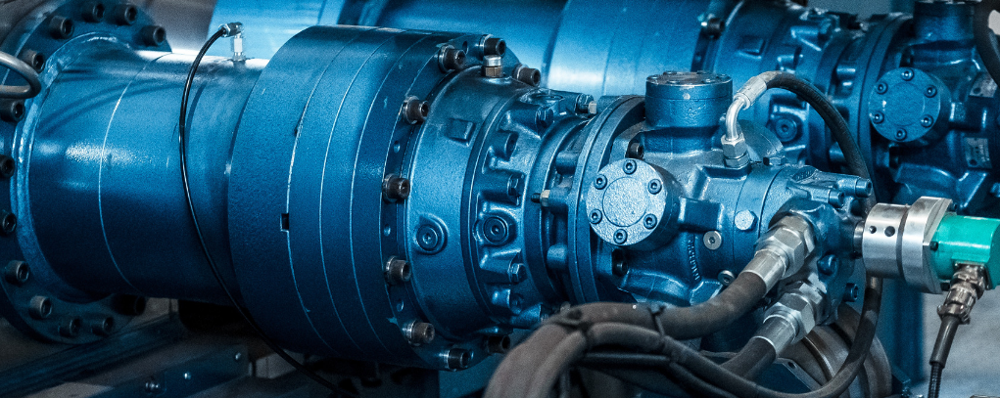

# Phase 3 Project
##### Skye Jeanat & Andrew Alderfer

## Condition Monitoring of Hydraulic Systems

### Data Understanding
<a href="https://archive.ics.uci.edu/ml/datasets/Condition+monitoring+of+hydraulic+systems#">**This data**</a> comes from a set of sensor measurements taken
during 2205 sixty second cycles of a hydraulic pump testing rig. During the testing the pump's maintenance
status was recorded. These various metrics of the test rigs physical condition will be the target variable
for our tests. The sensor data will be the predictors.

The goal will be to use sensor data (such as temperature, tank pressure, vibration magnitude, etc.) to
predict the state of the hydraulic pump.

The data is split between sensors. Each sensor has a specific sample rate qhich cooresponds to the columns
in its table. So `TS1.txt` contains temprature readings from one sensor. Its sample rate was 1hz for
each 60 second pump cycle. Therefore, in the `TS1.txt` file there are 60 columns and 2205 rows of data.

Each row represents one full cycle and each column represents one sample (in this case 1 second) of
readings from the temperatue sensor. To create features from this data we will need to come up with
methods for aggregating each row of the sensor data into a single column of data.

##### Raw Table 
|  cycle   |1s |2s |3s |.. |60s|
|  :---:   |---|---|---|---|---|
|  first  :| 0 | 1 | 2 |...|59 |
| second  :| 0 | 1 | 2 |...|59 |
|   ...    |...|...|...|...|...|
|   last  :| 0 | 1 | 2 |...|59 |

##### Taking the average of each row:
|  cycle   |  1s-60s  | aggregation |
|  :---:   |   :---:  |    :---:    |   
|  first : |  avg[0]  |    <<<<<    |
| second : |  avg[1]  |    <<<<<    |
|   ...    |    ...   |    <<<<<    |
|   last : |  avg[-1] |    <<<<<    |
 
* If we apply this "pattern" to `TS1.txt` we end up with one feature column: *the mean temperature reading
from the sensor for all cycles*. 
* Repeating this pattern for each table of **sensor data** creates a full feature set of mean readings for
all 17 sensors across each **2205 pump cycles**. 

### Business Understanding / Stakeholder Story
**Let's discuss!** Hydraulic pumps are used in many different types of industries and envirnoments. The
basic premise of the dataset is predicting maintenance schedules for machinery, but the context could be
anything from decreasing "down-time" for a powerplant, to predictive maintenance in buidling management, 
or applications in the shipping industry.
