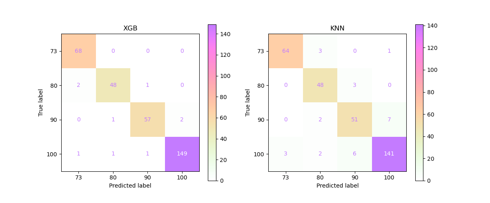
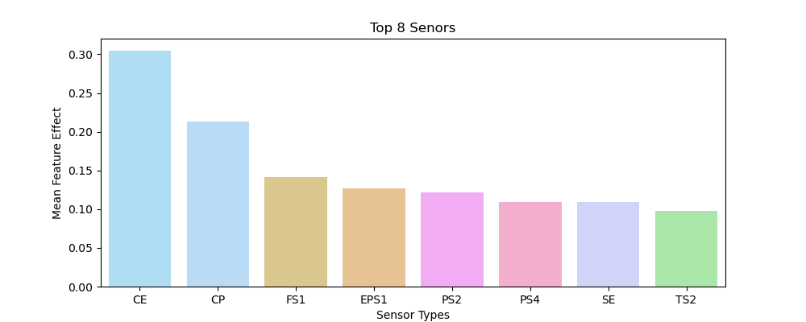
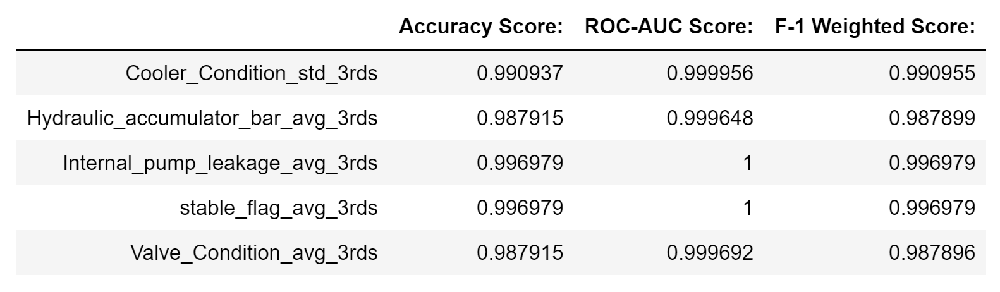

<!-- #region -->
# Phase 3 Project
##### Skye Jeanat & Andrew Alderfer

## Condition Monitoring of Hydraulic Systems

### Business Understanding / Stakeholder Story
**Let's discuss!** Hydraulic pumps are used in many different types of industries and envirnoments. The
basic premise of the dataset is predicting maintenance schedules for machinery, but the context could be
anything from decreasing "down-time" for a powerplant, to predictive maintenance in buidling management, 
or applications in the shipping industry.

### Data Understanding
<a href="https://archive.ics.uci.edu/ml/datasets/Condition+monitoring+of+hydraulic+systems#">**This data**</a> comes from a set of sensor measurements taken
during 2205 sixty second cycles of a hydraulic pump testing rig. During the testing the pump's maintenance
status was recorded. These various metrics of the test rigs physical condition will be the target variable
for our tests. The sensor data will be the predictors.

The goal will be to use sensor data (such as temperature, tank pressure, vibration magnitude, etc.) to
predict the state of the hydraulic pump.

The data is split between sensors. Each sensor has a specific sample rate qhich cooresponds to the columns
in its table. So `TS1.txt` contains temprature readings from one sensor. Its sample rate was 1hz for
each 60 second pump cycle. Therefore, in the `TS1.txt` file there are 60 columns and 2205 rows of data.

Each row represents one full cycle and each column represents one sample (in this case 1 second) of
readings from the temperatue sensor. To create features from this data we will need to come up with
methods for aggregating each row of the sensor data into a single column of data.

## Data Preparation

Each row represents one full cycle and each column represents one sample (in this case 1 second) of readings from the temperatue sensor. To create features from this data we will need to come up with methods for aggregating each row of the sensor data into a single column of data.

##### Raw Table (ex: TS1.txt)
| cycle  |1s |2s |3s |.. |60s|
| :---:  |---|---|---|---|---|
| first: | 0 | 1 | 2 |...|59 |
| second:| 0 | 1 | 2 |...|59 |
|   ...  |...|...|...|...|...|
| last:  | 0 | 1 | 2 |...|59 |

##### Taking the average of each row:
| test     |1s-60s | << |
| :---:    | :---: |:---|
| first:   | avg[0]| << |
| second:  | avg[1]| << |
|   ...    |  ...  | << |
| last:    |avg[-1]| << |

| test   |1s-20s    |21s-40s   |41s-60s   |  << |
| :---:  | :---:    | :---:    | :---:    | :---|
| first: |avg[0][0] |avg[0][1] |avg[0][2] |  << |
| second:|avg[1][0] |avg[1][1] |avg[1][2] |  << |
|   ...  |  ...     |  ...     |  ...     |  << |
| last:  |avg[-1][0]|avg[-1][1]|avg[-1][2]|  << |
 
* If we apply this "pattern" to `TS1.txt` we end up with one feature column: *the mean temperature reading
from the sensor for all cycles*. 
* Repeating this pattern for each table of **sensor data** creates a full feature set of mean readings for
all 17 sensors across each **2205 pump cycles**.
<!-- #endregion -->

### Target Variables
**Now that we can see the structure** of our target variables a little more clearly lets take a
look at the `profile.txt` file in our dataset. 

I will pull it inot a primary DataFrame object, so that we can continue to work with it; adding 
predictor variables and iterating over a test pipeline to find the best combinations for prediction.

Setting this up just requires pulling in the five columns and assigning column names based on our
encoding keys from the above dictionary.

## Modeling

As previously mentioned, the data set includes five target variables – cooler condition, valve condition, internal pump leakage, hydraulic accumulator (hydraulic pressure), and stable flag (stable condition). We determined that each of these target variables were vital to the stakeholder and will likely impact our final recommendation. As a result, several models were created. About two models were created for each target variable. Depending on the variable, utilized, certain features were utilized including simple averages of the 60-second cycle, the average change over the course of the cycle, the average and change every 20-seconds of the cycle, and standard deviation of both the full 60-second cycle and every 20-seconds. To begin, we will utilize a simple logistic regression model. Given the data and the stakeholder’s business problem, it will make most sense to run a grid search on several different model types to determine which produces the highest accuracy.

### First Model:
### Feature, Target Variable: Simple Average, Valve Condition

For our first model, we are utilizing the grid search to evaluate the Valve Condition as our target variable and utilizing the average metrics of each cycle (simple average) as our feature. To begin, we will evaluate five different models – a logistic regression model, a decision tree model, a random forest model, a K-nearest neighbors (KNN) model, a support vector machine model, and an XGBoost model. We will run a grid search for each of these models to evaluate the hyperparameters that will produce the highest accuracy scores. As a reminder, Valve Condition, measured as a percentage, includes four classifications – 100 meaning the pump was functioning at optimal switching behavior, 90 meaning there was a small lag, 80 meaning there was a severe lag, and 73 meaning the pump was close to total failure.

## Evaluation

After running all of the above models and inspecting their output we determined that **XGBoost** was the best model to iterate one more time. We were also able to determine which feature/target pairings resulted in the best predictions.

**Below** we set up test to see which of the sensors had the best feature importance on average. A series of functions in `helpers.py` were chained along with some search and result parsing to allow us to extract the relevant statistics.

### Top 8 Sensors
**Below** are the 8 top performing sensors in predicting the state of the hydraulic pump test rig.

### Final Results

**Below** we have the metrics from our final models.

#### XGBoost
We decided to go with the **XGBoost** model for our final iteration and Average of cycle thirds as the feature set for each target variable *except* Cooler Condition. For Cooler Condition we decided to use the Standard Deviation for Cycle 3rds as the feature. This was due to its consistently high score along all our metric axes.

## Conclusion:
### Recommendation:
Considering all of the above analysis we would recommend the stakeholder utilize an XGBoost predictive model. According to the numerous models and iterations we ran, the best, most accurate model the stakeholder should utilize is an XGBoost model. Further, to effectively utilize this model, we would recommend utilizing the model to predict a pump’s cooler condition and internal pump leakage. Based on our analysis, these predictive models generated the highest accuracy scores (99%+).
While the accuracy score of these models are high, there are reasons the model may not fully solve the business problem. The data we utilized was ultimately collected from a single test rig, meaning the environment in which this test rig was producing the data analyzed was carefully selected by the test coordinators. Therefore, there could have been situations that caused leaks or other faults with the pumps that were not accounted for, such as human error or other extreme situations.

**Next Steps:**
Further criteria and analyses could yield additional insights to further inform the stakeholder by:
* **Reviewing other testing data.** The stakeholder should consider utilizing a data set in addition to the one that was analyzed. As previously mentioned, although the data set included 2200+ records of testing data, this data was collected from a single test rig. Utilizing data from another test rig could be helpful with re-checking the accuracy of our final model and noting if our findings were consistent.
* **Collecting real-word data.** Another factor the stakeholder should consider is collecting real-world data. It is known that the stakeholder uses specific water pumps with their irrigation systems. As such, the stakeholder should consider setting up a system to collect daily data similar to that of the data set utilized. By doing so, the stakeholder could utilize the final model with the data processed through their irrigation system.

